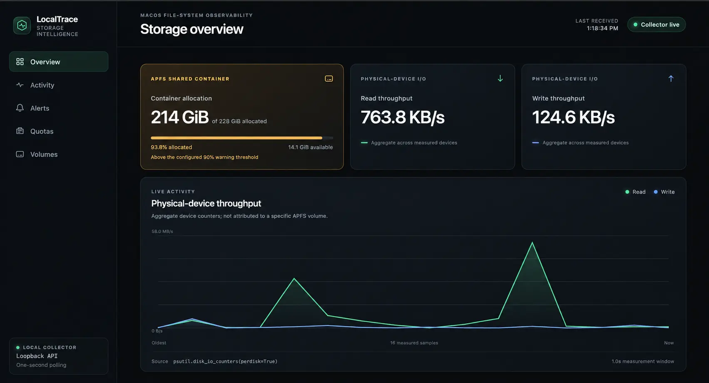
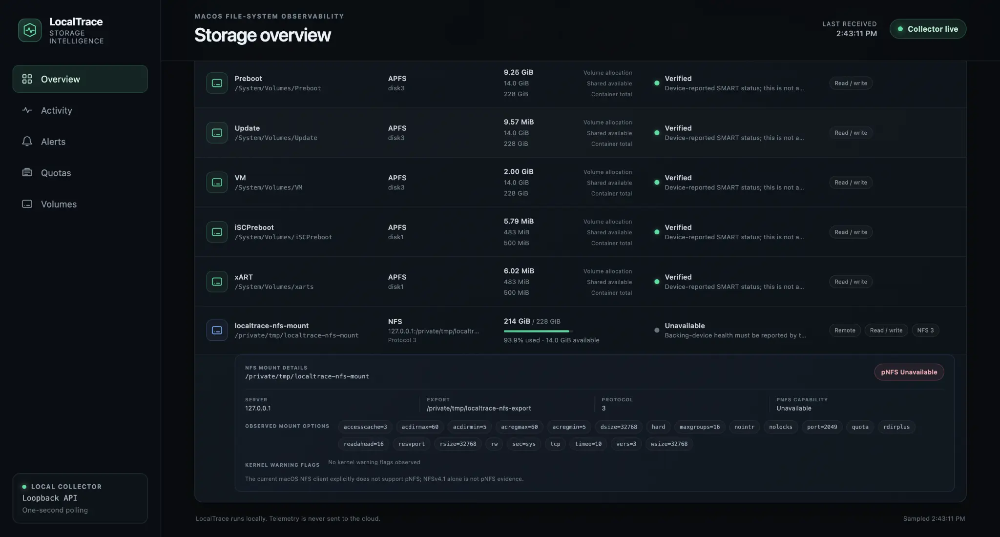
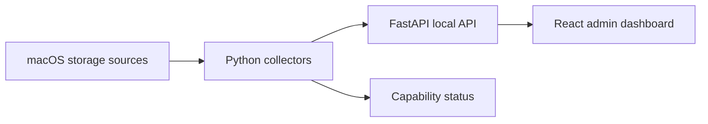

# LocalTrace

[](https://github.com/PrinceObasi/localtrace/actions/workflows/ci.yml)

[](LICENSE)

**A flight recorder for local-AI storage workloads on macOS.**

LocalTrace is a local-first administrator dashboard that turns macOS storage
telemetry into an operational story: what storage is mounted, how quickly data
is moving, when watched files grow unexpectedly, and what changed when an alert
was raised.



This project was built for the Tactical Computing Laboratories macOS File
System Tools challenge at HackWesTX 2026.

## Why LocalTrace stands out

- **APFS-aware capacity:** shared-container pressure is calculated once from
  container-level total and available space instead of double-counting sibling
  APFS volumes.
- **Explainable alerts:** rapid model-file growth is linked to the retained
  filesystem events that triggered it, including size deltas and ownership
  evidence.
- **Evidence over guesses:** unavailable SMART, quota, NFS, and pNFS
  capabilities remain visibly unavailable or partial instead of becoming fake
  zeroes or healthy states.
- **Designed around macOS:** collectors use macOS storage interfaces and
  FSEvents-backed observation while the service remains local-first and does
  not require privileged system-wide tracing.

## Current vertical slice (v0.3.0)

- Discovers mounted volumes and reports real capacity data.
- Identifies APFS and NFS mounts when present. NFS rows include the observed
  server, export, protocol version, and a safe allowlist of current mount
  options and warning flags from structured `nfsstat` data, with the mount
  record as fallback.
- Reports pNFS as `unavailable` on the current macOS NFS client. It preserves
  visible mount options as evidence, but never treats an option, NFSv4, or
  NFSv4.1 as proof of an active pNFS layout.
- Reports storage-health signals beyond capacity: APFS container ceiling and
  free space with per-volume roles, FileVault, seal state, and native APFS
  volume quotas; local Time Machine snapshot counts and ages; and NVMe
  controller SMART status from `system_profiler` as a second source when
  `diskutil` reports SMART unsupported for a mount.
- Scans every watched directory in the background and groups bytes by file
  owner, so an administrator can see who is consuming model storage even on
  APFS, which has no per-user quotas. Symlinks are not followed, hard links
  count once, and a scan that hits its budget is labeled partial.
- Reads native block and file quotas for the current macOS account through
  `/usr/bin/quota -uv`; only rows with a reportable nonzero limit field are
  displayed, with their filesystem-dependent meaning labeled.
- Samples cumulative physical-device counters and calculates read/write rates.
- Watches the local-AI model directories that already exist on the Mac
  (Ollama, Hugging Face, LM Studio, llama.cpp, Exo) plus a dedicated demo path
  through watchdog/FSEvents, and records bounded file change evidence. Model
  directories are observed read-only and are never created.
- Raises a deduplicated rapid-growth alert when a file crosses the configured
  threshold.
- Raises one capacity-pressure alert when a mounted volume or shared APFS
  container crosses the configured percentage, suppresses repeats while it
  stays high, and re-arms only after a real sample reaches the lower recovery
  boundary.
- Delivers every new alert beyond the dashboard: a macOS Notification Center
  banner and an append-only JSON Lines log at
  `~/Library/Logs/LocalTrace/alerts.jsonl`, so an administrator who is not
  watching the browser still finds out.
- Correlates a rapid-growth alert with its retained events in a
  **What changed?** view.
- Serves a versioned local FastAPI API.
- Displays live data in a local React administrator dashboard.
- Represents partial, unavailable, and warming-up metrics explicitly.
- Includes a deterministic local workload generator for demonstrations.

LocalTrace does not send telemetry to a cloud service and does not substitute
mock values when a macOS capability is unavailable.

## Live NFS validation



LocalTrace v0.2.1 was validated on macOS 26.2 against a live loopback
NFSv3/TCP mount. The collector discovered the `server:/export` source, parsed
the negotiated protocol and allowlisted mount options, identified the mount as
remote and writable, and kept backing-device health and pNFS explicitly
unavailable. A separate acceptance check read a server marker, wrote through
the NFS client path, verified the same content through the backing export, and
deleted the test file successfully.

This validates the macOS NFS client observation and read/write path. It is not
evidence of independent remote-server health, network performance, or an
active pNFS data path. The read/write check was separate from LocalTrace;
LocalTrace remains an observational tool. See
[`docs/NFS_VALIDATION.md`](docs/NFS_VALIDATION.md) for the recorded result and
teardown boundary.

## Quick start

### Requirements

- macOS 13 or newer
- Python 3.11 or newer
- Node.js 20 or newer
- `make`

### Install

```bash
make setup
```

If `python3 --version` is older than 3.11, choose a newer interpreter
explicitly. For example:

```bash
make setup PYTHON=python3.12

# Or, from an activated Conda environment using Python 3.11+
make setup PYTHON=python
```

### Run

```bash
make run
```

Then open <http://localhost:5173>. The API is available at
<http://localhost:8000/api/v1/health>.

The default rapid-growth threshold is 64 MiB. Capacity warns at 90% and re-arms
at 88%, a two-percentage-point hysteresis that prevents alert chatter. These
values can be changed for a transparent demonstration:

```bash
make run FILE_GROWTH_ALERT_BYTES=8388608 \
  CAPACITY_ALERT_PERCENT=75 CAPACITY_REARM_PERCENT=72
```

These are LocalTrace alert settings. They do not create or enforce filesystem
quotas.

### Choose what to watch

By default LocalTrace observes the demo path plus every well-known local-AI
model directory that already exists on the Mac:

| Tool | Directory |
| --- | --- |
| Ollama | `~/.ollama/models` |
| Hugging Face (transformers, MLX, diffusers) | `~/.cache/huggingface/hub` |
| LM Studio | `~/.lmstudio/models`, `~/.cache/lm-studio/models` |
| llama.cpp | `~/Library/Caches/llama.cpp` |
| Exo | `~/.cache/exo` |

A directory that does not exist is reported as `skipped` in `watch_targets`;
LocalTrace never creates it. Add your own directories (for example an external
model volume or a shared team folder) as a colon-separated list, or turn the
defaults off and watch only the demo path:

```bash
make run WATCH_PATHS=/Volumes/Models:~/team-models
make run WATCH_MODEL_DIRS=0
```

Additional directories are observed read-only. Only the demo path is created
if missing, because `make demo` writes there. Nested or duplicate entries are
skipped as already covered, and symbolic-link directories are refused.

### Alert delivery

Each alert raised by either rule is queued and delivered off the alerting
thread to two sinks:

- **Notification Center** through `/usr/bin/osascript`. The alert text is
  passed as script arguments (`on run argv`), never interpolated into the
  AppleScript, so a path containing quotes cannot change the script.
- **JSON Lines log**, one object per alert, appended to
  `~/Library/Logs/LocalTrace/alerts.jsonl` with mode `0600`. A symbolic link
  at the log path is refused rather than followed.

```bash
make run NOTIFY=0                        # log only, no banners
make run ALERT_LOG_PATH=/Volumes/Ops/localtrace-alerts.jsonl
make alert-log                           # tail the log in another terminal
```

Each alert id is delivered at most once per process. A failed sink is
reported in the alerts panel's **Delivery** line and at
`GET /api/v1/alerts` under `delivery`; it never removes the alert from the
dashboard.

### Storage health signals

Three probes refresh in the background (every 60 seconds by default) and are
served without blocking the dashboard:

| Probe | Utility | What it adds |
| --- | --- | --- |
| APFS containers | `diskutil apfs list -plist` | Container ceiling/free, physical stores, per-volume roles, FileVault, lock, seal state, and native APFS `CapacityQuota`/`CapacityReserve` |
| Local snapshots | `tmutil listlocalsnapshots` | Count, oldest, and newest local Time Machine snapshot per volume group |
| NVMe SMART | `system_profiler SPNVMeDataType -json` | Controller model, size, TRIM, link, and device-reported SMART status |

```bash
make run STORAGE_HEALTH_INTERVAL_SECONDS=30
```

Each probe has its own status, so a missing NVMe controller (external USB
disks are not covered) or an empty snapshot list does not degrade the other
two. Serial numbers are discarded. `tmutil` does not report snapshot size, so
LocalTrace shows none rather than estimating one.

### Per-owner usage

The same watched directories are rescanned in a background thread (every 60
seconds by default) and rolled up by file owner: bytes, file count, share of
the scanned total, and each owner's largest files. This is how LocalTrace
answers "who is filling the model storage?" on APFS, which has no per-user
quota mechanism. The scan is bounded by a file budget and a time budget so a
very large Hugging Face cache cannot stall the dashboard:

```bash
make run USAGE_SCAN_INTERVAL_SECONDS=15 USAGE_MAX_FILES=50000 USAGE_MAX_SECONDS=10
```

Ownership is the uid on the file at scan time and is evidence for
investigation, not proof of which process wrote it. Allocated bytes are an
upper bound on APFS because clones and sparse files can share blocks.

### Generate visible disk activity

In a second terminal:

```bash
make demo
```

The demo writes a file only inside LocalTrace's dedicated temporary demo
directory. Use `make demo-clean` to remove that generated file.
See [`docs/DEMO.md`](docs/DEMO.md) for the complete judge-facing walkthrough
and pre-demo checklist.

### Test

```bash
make test
```

## Architecture



The initial collectors use stable structured interfaces where macOS provides
them and isolate platform-specific behavior behind providers. See
[`ARCHITECTURE.md`](ARCHITECTURE.md) for the data contract and accuracy rules,
and [`docs/SOURCES.md`](docs/SOURCES.md) for the Apple platform evidence behind
the pNFS and quota claims.

## API

| Endpoint | Purpose |
| --- | --- |
| `GET /api/v1/health` | Service and platform status |
| `GET /api/v1/volumes` | Mounted-volume inventory and capacity |
| `GET /api/v1/quotas` | Native current-user quota visibility |
| `GET /api/v1/storage-health` | APFS containers, local snapshots, and NVMe SMART probes |
| `GET /api/v1/usage` | Per-owner bytes and largest files across watched directories |
| `GET /api/v1/io` | Physical-device counters and calculated rates |
| `GET /api/v1/events` | Recent file evidence from every watched directory, with `watch_targets` |
| `GET /api/v1/alerts` | Deterministic storage alerts |
| `GET /api/v1/alerts/{id}` | One alert with rule-specific evidence |
| `GET /api/v1/dashboard` | One snapshot optimized for the dashboard |

Interactive API documentation is available at <http://localhost:8000/docs>
while the backend is running.

## Metric accuracy

LocalTrace intentionally distinguishes what macOS proves from what an
application can only estimate:

- Device I/O counters describe physical devices; they are not labeled as
  per-volume traffic.
- APFS volumes may share free space inside one container, so their capacities
  must not be added together as if they were independent disks. Capacity
  alerts derive shared-container use as total minus available space while the
  volume inventory preserves macOS's raw per-volume allocation values.
- A missing quota command or unsupported platform is reported as
  `unavailable`, never as a zero quota. A successful probe with no reportable
  nonzero current-user record is `available` with an empty list.
- Missing SMART data is reported as `unavailable`, never `healthy`. A SMART
  value from `diskutil` or `system_profiler` is a device self-report, not an
  independent diagnosis, and both paths map the same words the same way.
- A native APFS volume quota is a per-volume limit set at volume creation. It
  is shown as such and is not a per-user quota.
- A native quota row is shown only when macOS reports a nonzero block or file
  soft/hard limit for the current account. LocalTrace observes those limits; it
  does not enforce them. An empty result does not prove the filesystem lacks
  quota support.
- APFS quota limits are labeled as absolute limits. LocalTrace joins a quota
  row to the exact mounted-volume path and uses the currently negotiated NFS
  version to label macOS NFSv4 fields as remaining availability. It does not
  calculate a misleading used-versus-limit percentage from them. If no exact
  current mount/version observation exists, the semantics remain `unknown`.
- The current macOS NFS client does not support pNFS, so LocalTrace reports it
  as `unavailable`. Protocol versions and pNFS-looking mount options remain raw
  observations, not proof that a layout was negotiated.
- NFS enrichment reads each mount's current structured `nfsstat` parameters,
  not the originally requested options, and does not retain filehandles,
  principals, realms, or raw JSON.
- Mount discovery reads the complete macOS mount table and then filters known
  pseudo-filesystems itself. This preserves ordinary NFS sources such as
  `server:/export`, which macOS `psutil.disk_partitions(all=False)` omits.
- Only `dead`, `not responding`, and `recovery` NFS warning flags are exposed.
  An empty flag list means no kernel warning flag was observed; it is not a
  server-health verdict.
- Capacity collection still uses the mounted filesystem's `statvfs` path via
  `psutil.disk_usage()`. A stale hard NFS mount can block that kernel call;
  the v0.2.x collector does not claim that this operation has a cancellable
  timeout.
- File-event evidence identifies changed paths and file owners. File ownership
  alone is not presented as proof of the process that wrote the file.
- Delivery status is about the sinks, not the alert. `0 delivered` with an
  available log means no alert has been raised yet, not that delivery is
  broken.
- Per-owner usage covers only the watched directories, never the whole
  volume. A scan that stops at its file or time budget is `partial` and
  `truncated`; its totals describe the files visited, not the directory. A
  missing watched directory is an `error` for that target only.

## Demonstration story

The target judge-facing sequence is:

1. Open LocalTrace and show the real Mac's mounted storage, NFS metadata when
   present, capacity, and native current-user quota state.
2. Start a local AI-style model write with `make demo`.
3. Watch physical-device throughput rise in the live chart.
4. Raise a deterministic rapid-growth alert.
5. Open **What changed?** to identify the affected path, size delta, and file
   owner.

All five steps are implemented in the current vertical slice. If you also show
a capacity alert, state the configured threshold plainly; the alert is an
observational LocalTrace policy, not a native quota or write block.

## Roadmap

- Sustained-I/O alert rules
- Per-owner usage trend history and a "single owner exceeds N% of watched
  storage" alert rule
- Webhook and email delivery sinks alongside Notification Center and the
  JSONL log
- NFS client RPC metrics and detection for any future macOS pNFS support
- Quota trend history and optional administrator-selected account visibility
- Read-only `diskutil verifyVolume` runs on demand as a background job
- SATA and USB device health where macOS exposes it
- Capacity-runway estimates and retained local history

## Security and privacy

- The API and dashboard bind to loopback interfaces by default, and the API
  rejects non-loopback Host headers to reduce DNS-rebinding exposure.
- No authentication or cloud account is required for the hackathon build.
- Subprocess calls use argument arrays, timeouts, and no shell interpolation.
- The default demo directory is under the current account's temporary
  directory. Model directories are watched read-only and are never created;
  LocalTrace refuses a symbolic link as any watched or immediate demo
  directory, and the workload file is created exclusively with mode
  `0600` rather than overwriting an existing path. These are accident guards,
  not a race-free sandbox against another hostile process under the same user.
- Alert delivery calls `osascript` with an argument array, a timeout, and the
  alert text as arguments rather than script source. The alert log is opened
  `O_APPEND | O_CREAT | O_NOFOLLOW` with mode `0600` under the current
  account's `~/Library/Logs`.
- Privileged system-wide tracing is not required for the core demonstration.

## License

[MIT](LICENSE)
