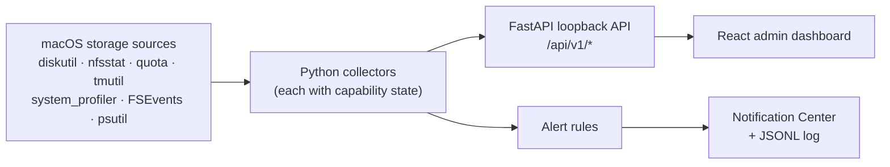

# LocalTrace

[](https://github.com/PrinceObasi/localtrace/actions/workflows/ci.yml)

[](LICENSE)

**Storage monitoring and alerting for Macs that run local AI.**

LocalTrace watches the directories where Ollama, Hugging Face, LM Studio,
llama.cpp, and Exo keep their models, measures the physical disks underneath
them, and tells an administrator three things the built-in tools do not: who
is consuming the space, how fast it is being consumed, and what changed the
moment an alert fired. It runs entirely on the Mac, needs no Xcode and no
elevated privileges, and reads only from native macOS interfaces.

<!-- Demo video: replace with the recorded walkthrough before judging -->
> **Demo:** _link to the 90-second screen recording goes here_ · Script:
> [`docs/DEMO.md`](docs/DEMO.md)


Built for the Tactical Computing Laboratories **macOS File System Tools**
challenge at HackWesTX 2026.

## What it does

- **Watches real model storage.** FSEvents-backed observation of every
  local-AI model directory that exists on the Mac, plus any path you add.
  Directories are read-only and never created.
- **Answers "whose files hold the space?"** A background scan groups bytes in
  the watched directories by owning account with each owner's largest files,
  the per-user view APFS cannot give you through quotas. Ownership is
  evidence for investigation, not proof of who performed the writes.
- **Measures throughput in GB/s.** Physical-device read/write rates from
  cumulative kernel counters, charted live.
- **Alerts and delivers.** Two deterministic rules (rapid file growth,
  capacity pressure with hysteresis) post to macOS Notification Center and an
  append-only JSONL log, then link each alert to the file events that caused
  it.
- **Reports health beyond capacity.** APFS container state including native
  volume quotas and seal status, local Time Machine snapshots holding space,
  and NVMe SMART self-reports.
- **Covers APFS and NFS.** APFS shared-container math that does not
  double-count sibling volumes; live NFS mount metadata from `nfsstat`; and an
  explicit, sourced answer on pNFS.
- **Never fakes a number.** Every metric carries `available`, `partial`,
  `warming_up`, `unavailable`, or `error`. Missing SMART is never "healthy";
  an empty quota probe is never "zero".

## Challenge coverage

| Challenge asks for | LocalTrace answer | Where |
| --- | --- | --- |
| File-system and backing-block-storage health | Per-mount SMART via `diskutil`; NVMe controller SMART via `system_profiler`; APFS seal/FileVault/lock state; local snapshot counts | Volumes panel, Storage health panel, `/api/v1/storage-health` |
| I/O performance in GB/s | Per-physical-device read/write rates from cumulative counters, warming-up state, counter-reset handling | Activity chart, `/api/v1/io` |
| Capacity and per-user quotas | APFS container-aware capacity; native current-user quotas via `quota -uv`; native APFS volume quotas via `diskutil apfs list`; per-owner usage rollup for the per-user view APFS lacks | Overview, Quotas panel, Usage panel, `/api/v1/usage` |
| Display metrics usefully for administrators | Local React dashboard with explicit capability states on every panel | <http://localhost:5173> |
| Alert administrators about nefarious users and capacity | Rapid-growth alerts with owner evidence; capacity-pressure alerts with re-arm hysteresis; Notification Center banners and a JSONL log | Alerts panel, `/api/v1/alerts`, `make alert-log` |
| Local (APFS) and shared (NFS, pNFS) volumes | APFS and NFS discovered from the full mount table; NFS server/export/version/options from `nfsstat`; pNFS reported `unavailable` because the macOS NFS client does not implement it | Volumes panel, [`docs/NFS_VALIDATION.md`](docs/NFS_VALIDATION.md), [`docs/SOURCES.md`](docs/SOURCES.md) |
| Other interesting metrics | File-change evidence linked to alerts; snapshot age; TRIM and link state; watch-target and delivery status | Alerts and Storage health panels |

## Quick start

Requirements: macOS 13+, Python 3.11+, Node.js 20+, `make`.

```bash
make setup      # venv + backend deps + frontend deps
make run        # API on 127.0.0.1:8000, dashboard on 127.0.0.1:5173
make demo       # in a second terminal: write a bounded .gguf-like workload
make alert-log  # in a third terminal: tail the JSONL alert log
make test       # backend tests, tooling tests, frontend build
```

Open <http://localhost:5173>. The interactive API docs are at
<http://localhost:8000/docs>. If `python3` is older than 3.11, pass an
interpreter: `make setup PYTHON=python3.12`.

## Configuration

All settings are `make run` variables that map to `LOCALTRACE_*` environment
variables.

| Variable | Default | Effect |
| --- | --- | --- |
| `WATCH_PATH` | `$TMPDIR/localtrace-demo` | Demo directory; the only path LocalTrace creates and writes to |
| `WATCH_PATHS` | _(empty)_ | Colon-separated extra directories to observe read-only |
| `WATCH_MODEL_DIRS` | `1` | Set `0` to skip the well-known model directories below |
| `FILE_GROWTH_ALERT_BYTES` | `67108864` (64 MiB) | Rapid-growth threshold per file since it entered the watch window |
| `CAPACITY_ALERT_PERCENT` | `90` | Capacity-pressure warning threshold |
| `CAPACITY_REARM_PERCENT` | threshold − 2 | Lower boundary a real sample must reach before the same volume can alert again |
| `NOTIFY` | `1` | Set `0` to disable Notification Center banners (log still written) |
| `ALERT_LOG_PATH` | `~/Library/Logs/LocalTrace/alerts.jsonl` | Append-only JSON Lines alert log |
| `USAGE_SCAN_INTERVAL_SECONDS` | `60` | Per-owner usage rescan cadence |
| `USAGE_MAX_FILES` / `USAGE_MAX_SECONDS` | `200000` / `20` | Scan budgets; exceeding either marks the scan `partial` and `truncated` |
| `STORAGE_HEALTH_INTERVAL_SECONDS` | `60` | APFS / snapshot / NVMe probe cadence |

Watched by default when present:

| Tool | Directory |
| --- | --- |
| Ollama | `~/.ollama/models` |
| Hugging Face (transformers, MLX, diffusers) | `~/.cache/huggingface/hub` |
| LM Studio | `~/.lmstudio/models`, `~/.cache/lm-studio/models` |
| llama.cpp | `~/Library/Caches/llama.cpp` |
| Exo | `~/.cache/exo` |

A directory that does not exist is `skipped` in `watch_targets`, not created.
Nested or duplicate entries are skipped as already covered, and symbolic-link
directories are refused.

## How the pieces work

### Alerts and delivery

**Rapid file growth** fires once per file when it grows past the threshold
after entering the watch window, and carries the retained file events (path,
size delta, owner) that led to it. **Capacity pressure** fires once when a
volume or shared APFS container crosses the threshold, stays silent while it
remains high, and re-arms only after a real sample reaches the recovery
boundary. Both rules hand new alerts to a delivery queue; a worker posts a
Notification Center banner through `osascript` (alert text passed as script
arguments, never interpolated) and appends a line to the JSONL log (opened
`O_APPEND | O_CREAT | O_NOFOLLOW`, mode `0600`). Delivery starts before the
watcher, so nothing is ever posted on the thread that raised the alert. The
alerts panel shows each sink's own outcome and counts; a sink whose last post
failed is labeled failed with the reason, and the alert itself is never
dropped.

### Per-owner usage

The watched directories are rescanned in a background thread and rolled up by
owning uid: bytes, file count, share of the scanned total, and the three
largest files. The table shows the top 64 owners and says so when there are
more. Symlinks are not followed (a Hugging Face snapshot link and its
blob count once), hard links are deduplicated, and allocated bytes are labeled
an upper bound because APFS clones and sparse files share blocks. A scan that
hits its file or time budget is `partial` and `truncated`; its totals describe
the files visited, not the directory.

### Storage health

Three independent probes, each with its own status:

| Probe | Utility | Adds |
| --- | --- | --- |
| APFS containers | `diskutil apfs list -plist` | Ceiling/free, physical stores, per-volume roles, FileVault, lock, seal, native `CapacityQuota`/`CapacityReserve` |
| Local snapshots | `tmutil listlocalsnapshots` | Count, oldest, newest per volume group (size is not reported by tmutil and is not estimated) |
| NVMe SMART | `system_profiler SPNVMeDataType -json` | Model, size, TRIM, link, device-reported SMART; serials discarded |

### NFS and pNFS

LocalTrace reads the complete mount table (psutil's default drops
`server:/export` sources), enriches each NFS mount from structured `nfsstat`
output, and exposes only allowlisted options and the `dead`, `not
responding`, and `recovery` flags. v0.2.1 was validated against a live
loopback NFSv3/TCP mount on macOS 26.2, including a separate read/write
acceptance check; see [`docs/NFS_VALIDATION.md`](docs/NFS_VALIDATION.md). The
current macOS NFS client does not implement pNFS, so LocalTrace reports it
`unavailable` and never infers a layout from NFSv4.1 or option names; the
evidence is in [`docs/SOURCES.md`](docs/SOURCES.md).


## Architecture



Collectors that call slow utilities (usage scan, storage health) run in
background threads and serve their newest completed result, so one-second
dashboard polling never blocks on `system_profiler` or a large model cache.
[`ARCHITECTURE.md`](ARCHITECTURE.md) has the data contract and per-metric
accuracy rules.

## API

| Endpoint | Purpose |
| --- | --- |
| `GET /api/v1/health` | Service status and every collector's capability |
| `GET /api/v1/dashboard` | One snapshot with all of the below |
| `GET /api/v1/volumes` | Mounted-volume inventory, capacity, per-mount health, APFS/NFS detail |
| `GET /api/v1/io` | Physical-device counters and calculated rates |
| `GET /api/v1/quotas` | Native current-user quota records |
| `GET /api/v1/usage` | Per-owner bytes and largest files across watched directories |
| `GET /api/v1/storage-health` | APFS containers, local snapshots, NVMe SMART |
| `GET /api/v1/events` | Recent file evidence and `watch_targets` |
| `GET /api/v1/alerts` | Alerts newest-first with `delivery` status |
| `GET /api/v1/alerts/{id}` | One alert with rule-specific evidence |

## Metric accuracy

LocalTrace separates what macOS proves from what an application could only
estimate. The rules that shape every panel:

- **Capacity.** APFS volumes share a container, so per-volume free space is
  not summed. Alerts use container total minus available; the inventory keeps
  the raw per-volume values.
- **I/O.** Rates describe physical devices, not volumes, users, or files.
- **Health.** A SMART value from `diskutil` or `system_profiler` is a device
  self-report mapped identically on both paths. Missing or unsupported is
  `unavailable`, never healthy. An empty NFS warning-flag list is not a
  server-health verdict.
- **Quotas.** Native rows appear only for nonzero limits on the current
  account and are observed, not enforced. APFS limits are absolute; NFSv4
  fields are remaining availability and never turned into a percentage; an
  APFS volume quota is per-volume, not per-user. LocalTrace's own thresholds
  are alerting policy, not quotas.
- **Ownership.** File owner is investigation evidence, not proof of the
  process or person that wrote the file.
- **Usage and snapshots.** Per-owner usage covers watched directories only;
  a budget-limited scan says so. Snapshot size is not reported by `tmutil`
  and is not invented.
- **NFS.** Mount data is the current negotiated state from `nfsstat`, not the
  requested options; filehandles, principals, and realms are discarded. A
  stale hard NFS mount can block the `statvfs` capacity read and the
  collector does not claim otherwise.
- **Delivery.** Counts are per sink and per alert. "No alert delivered yet"
  with available sinks means no alert has fired; it is not a delivery
  failure.

## Future work

**Near term (the next release).** A sustained-I/O rule that alerts when
physical-device throughput stays above a threshold for a configurable
window, complementing the burst-oriented rapid-growth rule. An owner-share
rule ("one uid holds more than N% of watched storage") that turns the
per-owner rollup into an alert. Persistent history in SQLite for capacity,
throughput, per-owner usage, and alerts, so the dashboard can show trends and
a capacity-runway estimate instead of only the current sample.

**Medium term.** Additional delivery sinks (webhook and email) sharing the
existing queue, so a fleet of Macs can report to one endpoint. An on-demand
read-only `diskutil verifyVolume` job with progress and result surfaced as a
health signal. Health coverage for SATA and USB-attached devices where macOS
exposes it. Administrator-selected account visibility for native quotas
beyond the current user, with the same "observed, not enforced" contract.

**Longer term.** Validation against an independent remote NFS server rather
than a loopback export, plus NFS client RPC and retransmission metrics from
`nfsstat`. Detection of pNFS layout negotiation if a future macOS NFS client
implements it, so the `unavailable` label flips only on real evidence.
Process-level write attribution through `fs_usage` or an Endpoint Security
client for deployments that can grant that privilege, replacing owner
evidence with actual writer identity. A Swift menu-bar agent that consumes
the same API for administrators who prefer not to keep a browser tab open.

## Security and privacy

- API and dashboard bind to loopback; the API rejects non-loopback Host
  headers to reduce DNS-rebinding exposure. No authentication or cloud
  account in the hackathon build; nothing leaves the Mac.
- Every subprocess uses an absolute path, an argument array, a timeout, and
  no shell. Alert text reaches `osascript` as arguments, not script source.
- Model directories are watched read-only and never created. Symbolic-link
  directories are refused everywhere. The demo file is created exclusively
  with mode `0600`; the alert log is opened with `O_NOFOLLOW` and mode
  `0600`. These are accident guards, not a sandbox against a hostile process
  running as the same user.
- Serial numbers, NFS filehandles, principals, and realms are discarded
  before anything is retained.
- No privileged tracing is required.

## License

[MIT](LICENSE)
